# FitLog

  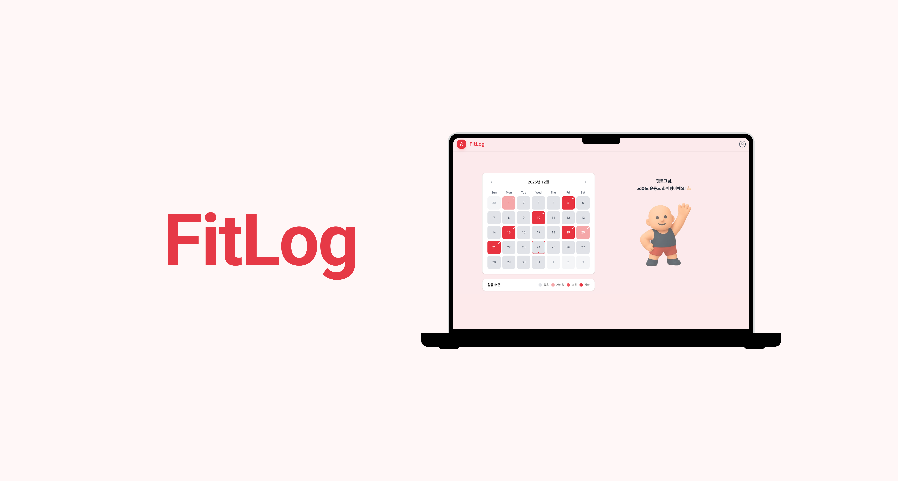

 

## 목차

- [📝 프로젝트 소개](#introduction)
- [🛠️ 기술 스택](#tech)
- [🌟 주요 기능](#function)
- [🔐 인증 및 접근 제어](#auth-architecture)
- [🧠 핵심 설계 포인트](#design)
- [🧑🏻‍💻 프로젝트 멤버](#member)

 

## 📝 프로젝트 소개

- **프로젝트 기간** : 2025.10 ~ 2025.12

- **목적**  
  하루의 운동 목표를 투두리스트 형태로 계획하고, 운동 수행 여부를 기록하여 **성취 과정을 시각적으로 확인할 수 있는 운동 관리 웹 서비스**입니다.

- **기대 효과**
  - **운동 기록의 체계화**
    - 날짜 · 운동 · 세트 단위로 기록을 관리하여 운동 내역을 한눈에 파악할 수 있습니다.
  - **운동 지속성 향상**
    - 잔디형 캘린더 기반 시각화를 통해 성취감을 제공하고 꾸준한 운동 습관 형성을 돕습니다.
  - **자기관리 역량 강화**
    - 누적 데이터를 통해 스스로 운동 패턴을 점검하고 개선할 수 있습니다.

 

## 🛠️ 기술 스택

<table>
  <thead>
    <tr>
      <th>분류</th>
      <th>기술 스택</th>
    </tr>
  </thead>
  <tbody>
    <tr>
      <td>프론트엔드</td>
      <td>
        
        
        
        
        
      </td>
    </tr>
    <tr>
      <td>백엔드</td>
      <td>
        
        
        
        
      </td>
    </tr>
    <tr>
      <td>데이터베이스</td>
      <td>
        
      </td>
    </tr>
  </tbody>
</table>

 

## 🌟 주요 기능

### **Auth 페이지**

- **로그인 (Login)**
  - DB에 저장된 회원 정보를 기반으로 아이디와 비밀번호를 검증하여 로그인할 수 있습니다.

<table>
  <tr>
    <td>
      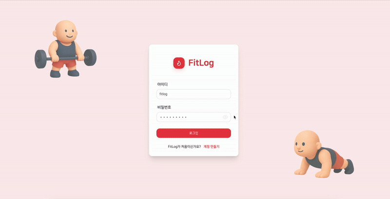
    </td>
  </tr>
  <tr>
    <td align="center">로그인</td>
  </tr>
</table>

 

- **회원가입 (Sign Up)**
  - 회원 정보를 입력하여 회원가입을 진행할 수 있습니다.

<table>
  <tr>
    <td>
      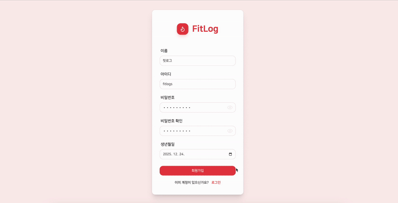
    </td>
  </tr>
  <tr>
    <td align="center">회원가입</td>
  </tr>
</table>

 

### **메인 페이지**

#### 1) 캘린더 및 운동 목표 관리

- **운동 목표 설정 / 삭제**
  - 날짜를 선택하여 운동 종목을 추가하고, 세트당 횟수와 무게를 설정할 수 있습니다.  
    (당일 및 미래 날짜의 목표 설정 가능)

<table>
  <tr>
    <td>
      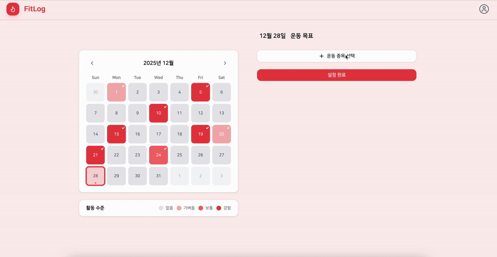
    </td>
    <td>
      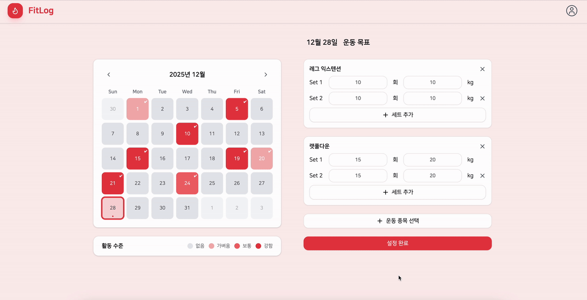
    </td>
  </tr>
  <tr>
    <td align="center">운동 목표 설정</td>
    <td align="center">운동 목표 삭제</td>
  </tr>
</table>

 

- **운동 기록 확인**
  - 현재까지의 운동 기록을 확인할 수 있습니다.
  <table>
    <tr>
      <td>
        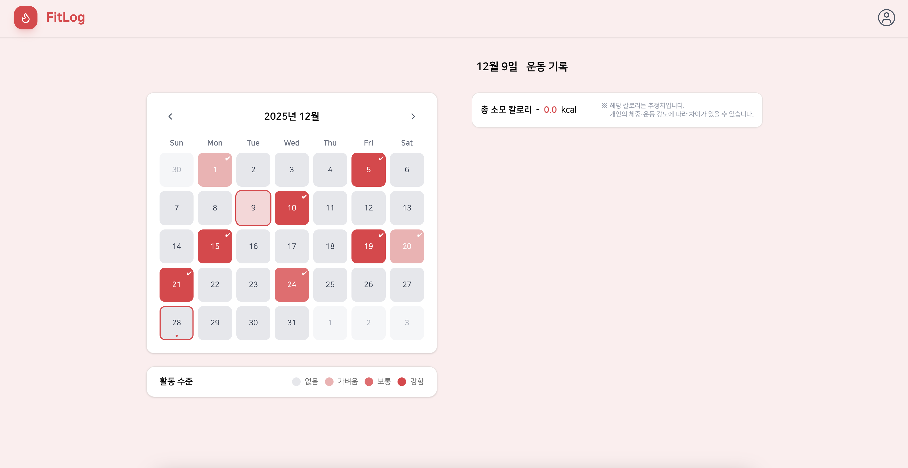
      </td>
      <td>
        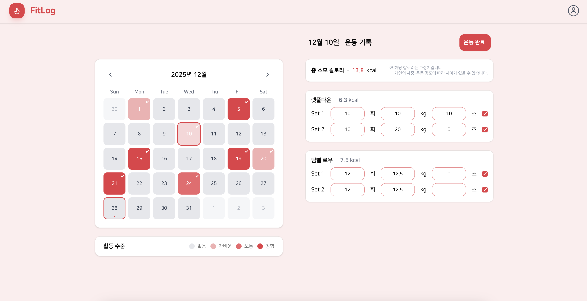
      </td>
    </tr>
    <tr>
      <td align="center">운동 기록 없음</td>
      <td align="center">운동 기록 있음</td>
    </tr>
  </table>

 

- **잔디형 캘린더 시각화**
  - 날짜별 운동 완료 상태를 색상으로 시각화합니다.
  <table>
    <tr>
      <td>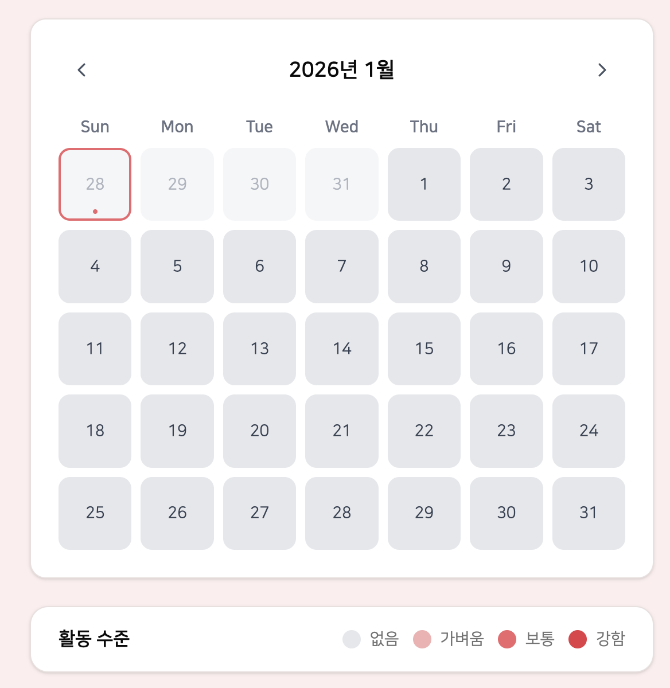</td>
      <td>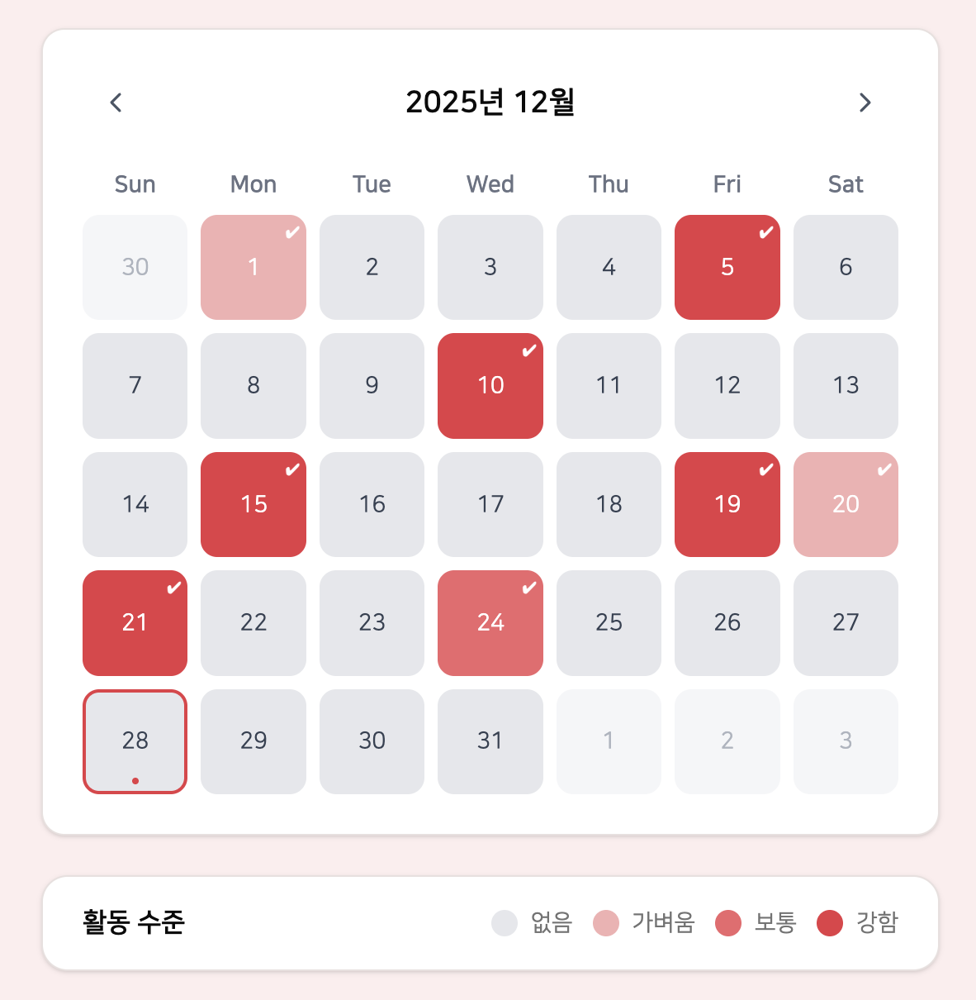</td>
    </tr>
    <tr>
      <td align="center">기본 상태</td>
      <td align="center">운동 완료 상태</td>
    </tr>
  </table>

 

#### 2) 프로필 관리

- **프로필 조회 / 수정**
  - 이름, 나이(만 나이 자동 계산), 자기소개, 프로필 이미지를 관리할 수 있습니다.

<table>
  <tr>
    <td>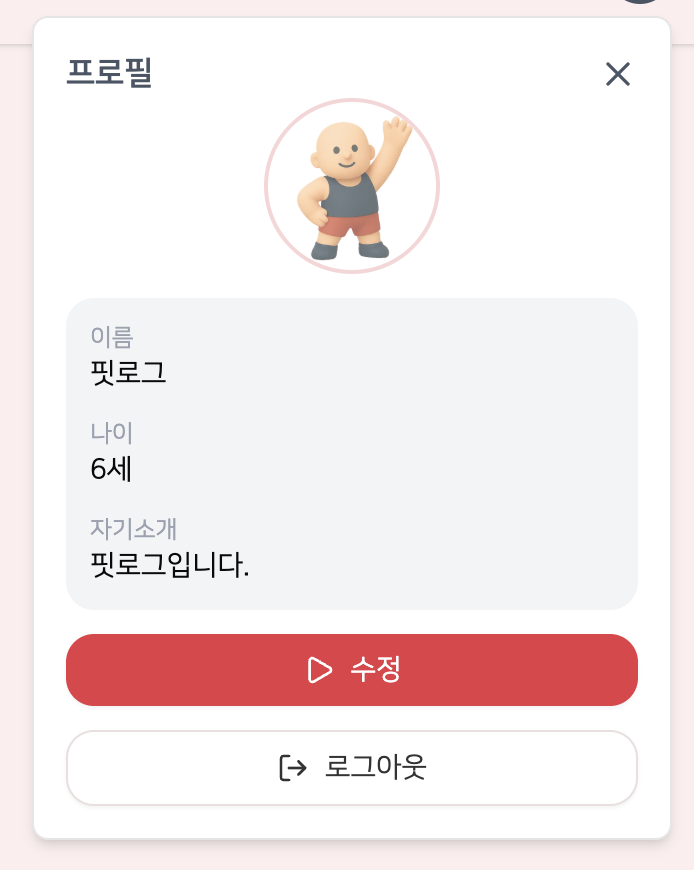</td>
    <td>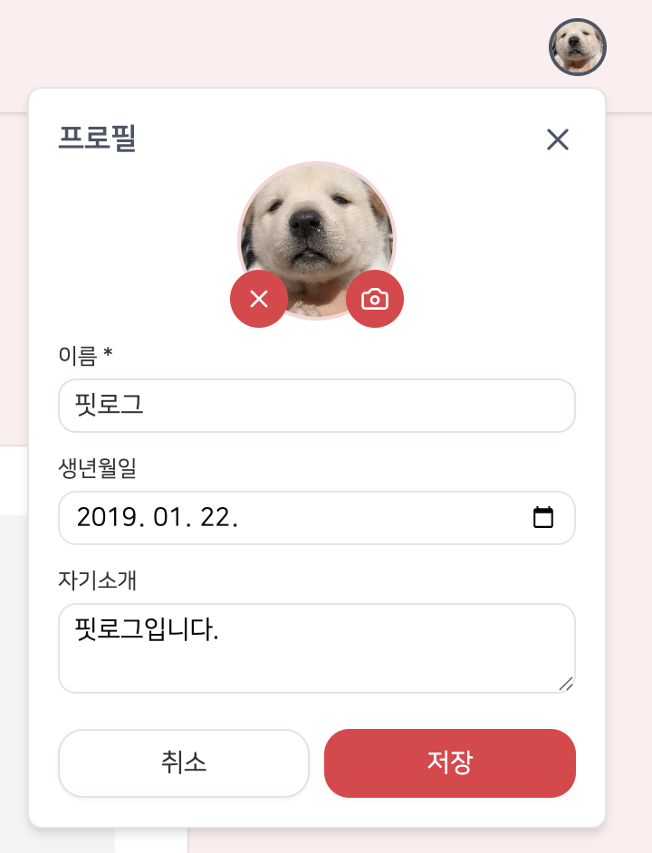</td>
  </tr>
  <tr>
    <td align="center">프로필 조회</td>
    <td align="center">프로필 수정</td>
  </tr>
</table>

 

### **세부 페이지**

- **운동 세트 완료 체크**  
  개별 세트를 완료하면 체크 박스를 통해 완료 여부를 기록할 수 있습니다.

<table>
  <tr>
    <td>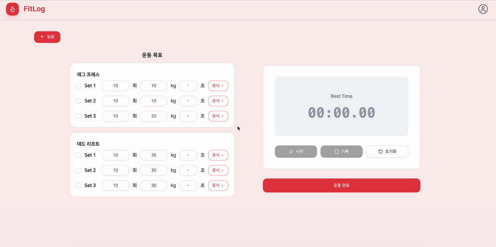</td>
  </tr>
  <tr>
    <td align="center">세트 완료 체크</td>
  </tr>
</table>

 

- **휴식 / 타이머 기능**
  - 세트 완료 후 휴식 타이머를 실행하고, 휴식 시간을 기록하거나 초기화할 수 있습니다.

<table>
  <tr>
    <td></td>
    <td>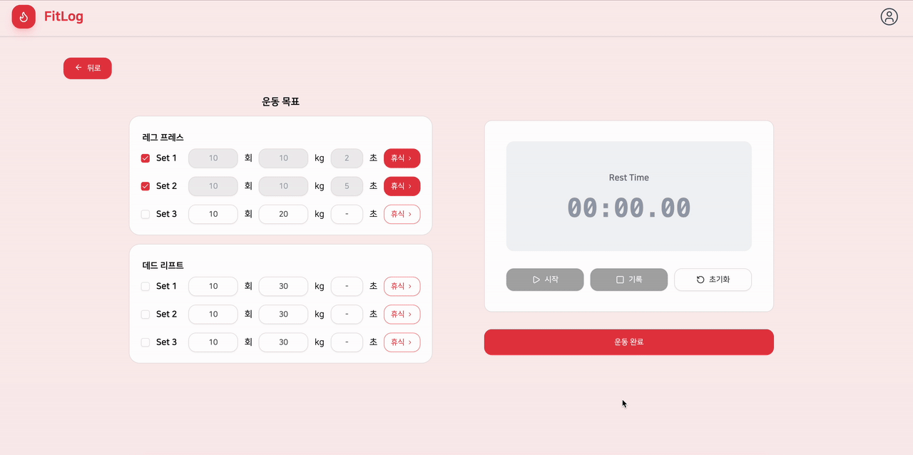</td>
  </tr>
  <tr>
    <td align="center">휴식 기록</td>
    <td align="center">휴식 초기화</td>
  </tr>
</table>

 

### **에러 페이지**

- **404 에러 페이지**

<table>
  <tr>
    <td>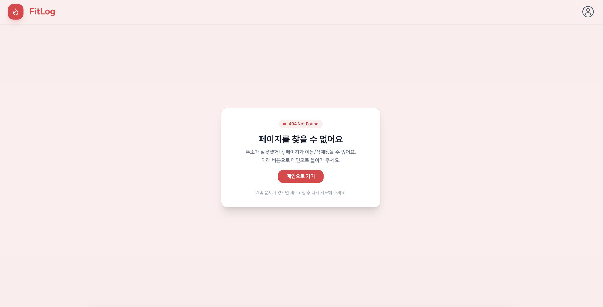</td>
  </tr>
  <tr>
    <td align="center">404 에러</td>
  </tr>
</table>

 

## 🔐 인증 및 접근 제어

- JWT 기반 인증 구조를 사용합니다.
- Access Token은 클라이언트 메모리(Redux)에서 관리하고, Refresh Token은 HttpOnly 쿠키로 저장하여 보안을 강화했습니다.
- 인증 여부에 따라 Auth 페이지와 메인 페이지 접근을 분리하여 비인가 사용자의 메인 기능 접근을 제한했습니다.

 

## 🧠 핵심 설계 포인트

- 날짜 → 운동 → 세트 단위로 데이터를 구조화하여 운동 기록을 세밀하게 관리했습니다.
- 운동 목표와 실제 수행 기록을 분리하여 계획 대비 수행 여부를 명확히 파악할 수 있도록 설계했습니다.
- 잔디형 캘린더 시각화를 통해 누적 성취도를 직관적으로 확인할 수 있도록 구현했습니다.

 

## 🧑🏻‍💻 프로젝트 멤버

|                  이름                  | 역할               |
| :------------------------------------: | :----------------- |
|  [김주희](https://github.com/joooii)   | PM, FE, BE, Design |
| [박준형](https://github.com/joonhyong) | FE, BE, Design     |
